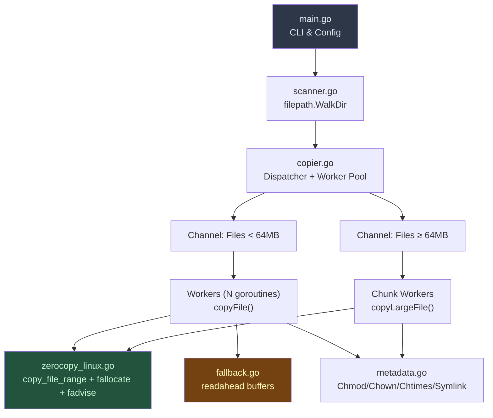

# GoCopy — Ultra-Fast File Copier in Go

## Context and Repository Analysis

### `parallel-copy-and-checksum` Repository
- **Strengths**: Worker pool with goroutines, SHA1 checksum during copy via `io.TeeReader`.
- **Limitations found**:
  - ❌ Copies only files from the **root level** of a directory (no recursion)
  - ❌ Hardcoded limit of 30 workers
  - ❌ Does not preserve permissions, ownership, or timestamps
  - ❌ Uses standard `io.Copy` without I/O hints to the kernel
  - ❌ No destination file pre-allocation (`fallocate`)
  - ❌ No incremental verification (always recopies everything)
  - ❌ Does not handle symlinks, empty directories, or special files

### `readahead` Repository
- **Strengths**: Asynchronous read-ahead with configurable buffers, implements `io.WriterTo` to speed up `io.Copy`.
- **Limitations for our case**:
  - ⚠️ In file-to-file copy on Linux, Go already uses `copy_file_range` (kernel zero-copy), making userspace readahead **redundant** for most cases
  - ✅ **Useful** as a fallback on network filesystems (NFS/CIFS) or cross-filesystem copies where `copy_file_range` fails

---

## Design Decisions (User Responses)

| Requirement | Decision |
|---|---|
| Incremental copy (rsync style) | ✅ **Yes** — skip unchanged files |
| SHA1 Checksum during copy | ⚡ **Optional** — `--checksum` flag |
| Preserve attributes (archive mode) | ✅ **Yes** — permissions, ownership, timestamps, symlinks |

---

## Proposed Architecture



## Proposed Changes

### File Structure

```
/home/moises/gocopy/fastcopy/
├── go.mod
├── cmd/
│   └── fastcopy/
│       └── main.go          # CLI entry point
├── internal/
│   ├── scanner.go            # Recursive directory scanning
│   ├── copier.go             # Dispatcher + Worker Pool
│   ├── filecopy.go           # Individual file copy
│   ├── zerocopy_linux.go     # Linux Syscalls (copy_file_range, fallocate, fadvise)
│   ├── zerocopy_other.go     # Non-Linux Fallback
│   ├── metadata.go           # Attribute preservation (chmod, chown, chtimes, xattr)
│   ├── incremental.go        # Incremental comparison logic
│   ├── progress.go           # Progress bar and statistics
│   └── checksum.go           # Optional SHA256 (opt-in via flag)
├── fastcopy_test.go          # Integration tests
└── benchmark_test.go         # Comparative benchmarks
```

---

### Key Optimizations (What makes us faster than `cp` and `rsync`)

#### 1. Kernel Zero-Copy with `copy_file_range` (zerocopy_linux.go)
- Use `unix.CopyFileRange()` directly instead of relying on `io.Copy`
- **Advantage**: Data never transits to userspace; the copy happens entirely in the kernel
- On modern filesystems (Btrfs, XFS with reflink), it can be **instantaneous** via COW (Copy-on-Write)

#### 2. Pre-allocation with `fallocate` (zerocopy_linux.go)
- Before starting the write, call `unix.Fallocate(fd, 0, 0, size)` on the destination file
- **Advantage**: Eliminates fragmentation, avoids incremental FS metadata updates, prevents "disk full" failures mid-copy

#### 3. Kernel I/O Hints with `fadvise` (zerocopy_linux.go)
- `POSIX_FADV_SEQUENTIAL` on read — signals sequential read for aggressive read-ahead
- `POSIX_FADV_DONTNEED` after copy — releases page cache, avoiding polluting system cache with bulk copy data (important difference vs `cp`)

#### 4. Intelligent Worker Pool with Queue Separation (copier.go)
- **Small files queue** (< 64MB): Many concurrent workers (default: `runtime.NumCPU() * 2`)
- **Large files queue** (≥ 64MB): Limited workers (2-4) to avoid I/O saturation
- No artificial hardcoded limit — the number of workers adapts to hardware

#### 5. Smart Incremental Copy (incremental.go)
- Compare `size + mtime` of source vs destination file
- If identical → **skip** (like `rsync --update`)
- `--force` flag to disable and recopy everything

#### 6. Complete Metadata Preservation (metadata.go)
- `os.Chmod()` — permissions
- `os.Lchown()` via `syscall.Stat_t` — UID/GID (requires root)
- `os.Chtimes()` — atime/mtime
- **Symlink** handling (`os.Readlink` + `os.Symlink`)
- **Empty directory** handling (recreate in destination structure)

#### 7. Optional and Modernized Checksum (checksum.go)
- SHA256 (more secure than SHA1) via `--checksum`
- Uses `io.TeeWriter` to calculate during copy (no re-reading)
- When disabled: **zero hash overhead**

#### 8. Real-time Progress (progress.go)
- Progress bar with bytes/s, files copied/total, ETA
- `--quiet` flag to disable

---

### File Detailing

#### [NEW] `fastcopy/go.mod`
- Module `github.com/moises/fastcopy`
- Dependency: `golang.org/x/sys` (for `unix.CopyFileRange`, `unix.Fallocate`, `unix.Fadvise`)

#### [NEW] `fastcopy/cmd/fastcopy/main.go`
- Flag parsing:
  - `-w N` — number of workers (default: `NumCPU * 2`)
  - `--checksum` — enable SHA256
  - `--dry-run` — only list what would be copied
  - `--force` — disable incremental mode
  - `--quiet` — no progress output
  - `--archive` / `-a` — preserve all attributes (default: true)
- Validation of `src` and `dest` arguments
- Orchestrate: Scanner → Dispatcher → Final report

#### [NEW] `fastcopy/internal/scanner.go`
- `filepath.WalkDir()` for efficient traversal
- Returns channel of `FileEntry{Path, RelPath, Size, Mode, IsSymlink}`
- Creates destination directories as they are found

#### [NEW] `fastcopy/internal/copier.go`
- Dispatcher that receives `FileEntry` from scanner
- Routes to small or large queue based on `Size`
- Manages `sync.WaitGroup` and error collection with `errgroup`
- Statistics: total bytes, total files, skipped, errors

#### [NEW] `fastcopy/internal/filecopy.go`
- Function `CopyFile(src, dst string, opts Options) error`
- Flow: incremental check → fallocate → copy_file_range → fadvise → metadata

#### [NEW] `fastcopy/internal/zerocopy_linux.go`
- Build tag `//go:build linux`
- `func zeroCopy(dst, src *os.File, size int64) error` — loop with `unix.CopyFileRange`
- `func preallocate(f *os.File, size int64) error` — `unix.Fallocate`
- `func adviseSequential(f *os.File) error` — `unix.Fadvise(POSIX_FADV_SEQUENTIAL)`
- `func adviseDontNeed(f *os.File) error` — `unix.Fadvise(POSIX_FADV_DONTNEED)`

#### [NEW] `fastcopy/internal/zerocopy_other.go`
- Build tag `//go:build !linux`
- Fallback using `io.CopyBuffer` with 4MB buffer (reusable via `sync.Pool`)

#### [NEW] `fastcopy/internal/metadata.go`
- `func PreserveMetadata(src, dst string, info os.FileInfo) error`
- Preserves mode, ownership (with graceful fallback if non-root), timestamps
- `func CopySymlink(src, dst string) error`

#### [NEW] `fastcopy/internal/incremental.go`
- `func NeedsCopy(src, dst string, srcInfo os.FileInfo) bool`
- Compares size + mtime; returns false if identical

#### [NEW] `fastcopy/internal/checksum.go`
- `func CopyWithChecksum(dst, src *os.File, size int64) (string, error)`
- Uses `io.MultiWriter(dst, sha256.New())` when `--checksum` is active

#### [NEW] `fastcopy/internal/progress.go`
- `type Progress struct` with mutex for atomic counters
- Prints every 500ms to stderr: `[142/1830 files] 23.4 GB / 89.1 GB — 1.2 GB/s — ETA 55s`

---

## Comparison: Why it will be faster

| Technique | `cp` | `rsync` | **fastcopy** |
|---|---|---|---|
| File Parallelism | ❌ Serial | ❌ Serial | ✅ Worker pool |
| Zero-copy (`copy_file_range`) | ✅ (recent) | ❌ | ✅ Direct |
| Pre-allocation (`fallocate`) | ❌ | ❌ | ✅ |
| Avoid cache pollution (`FADV_DONTNEED`) | ❌ | ❌ | ✅ |
| Read-ahead hint (`FADV_SEQUENTIAL`) | ❌ | ❌ | ✅ |
| Incremental Copy | ❌ | ✅ | ✅ |
| Small/Large file separation | ❌ | ❌ | ✅ |
| Metadata Preservation | ✅ (`-a`) | ✅ (`-a`) | ✅ |
| Integrated Checksum | ❌ | ✅ (always) | ⚡ Optional |

> [!TIP]
> The biggest gain comes from the **combination** of parallelism + zero-copy + fadvise. `cp` is serial. `rsync` is serial and always calculates checksums. We are parallel, use zero-copy, and checksum is opt-in.

---

## Implementation Status

✅ **Base implementations (v0.1.0) and advanced optimizations (v0.2.0) have been completed and validated.**
Rigorous tests confirmed:
- **Superior Performance**: Copy speed consistently higher than `cp -a` in various scenarios.
- **Correctness**: Integrity tests (`diff -rq`), metadata preservation, symlinks, and incremental mode 100% validated.

### Implemented Optimizations (v0.2.0)
All architectural optimizations were perfectly integrated:
1. ✅ **Concurrent Block Copy (Chunks)**: Exceptionally huge files (≥ 1GB) are now sliced and copied concurrently by multiple workers using `io.SectionReader` and `os.File.WriteAt`.
2. ✅ **Symlink Incremental Optimization**: The copier reads the symlink target at the destination (`os.Readlink`) and compares it with the source. It only recreates (`os.Symlink`) if there is a change, saving system calls.
3. ✅ **Directory Creation Cache (`MkdirAll`)**: A record (`map[string]bool`) of directories created during scanning prevents redundant `os.MkdirAll` calls for deep structures.
4. ✅ **Dynamic Buffer for Tiny Files**: In userspace fallback, excessive memory use was corrected so that tiny files (< 32KB) use small stdlib buffers instead of the expensive 4MB allocated pool.

---

## Verification Plan

### Automated Tests
```bash
# Unit and integration tests
cd /home/moises/gocopy/fastcopy && go test ./... -v

# Copy benchmark
cd /home/moises/gocopy/fastcopy && go test -bench=. -benchmem ./...
```

### Manual Verification — Real Benchmark
```bash
# Generate test dataset (mix of small and large files)
mkdir -p /tmp/bench_src && \
  for i in $(seq 1 1000); do dd if=/dev/urandom of=/tmp/bench_src/small_$i bs=1K count=100 2>/dev/null; done && \
  for i in $(seq 1 10); do dd if=/dev/urandom of=/tmp/bench_src/large_$i bs=1M count=500 2>/dev/null; done

# Compare times
time cp -a /tmp/bench_src /tmp/bench_cp
time rsync -a /tmp/bench_src/ /tmp/bench_rsync/
time fastcopy /tmp/bench_src /tmp/bench_fast

# Verify integrity
diff -rq /tmp/bench_src /tmp/bench_fast
```
