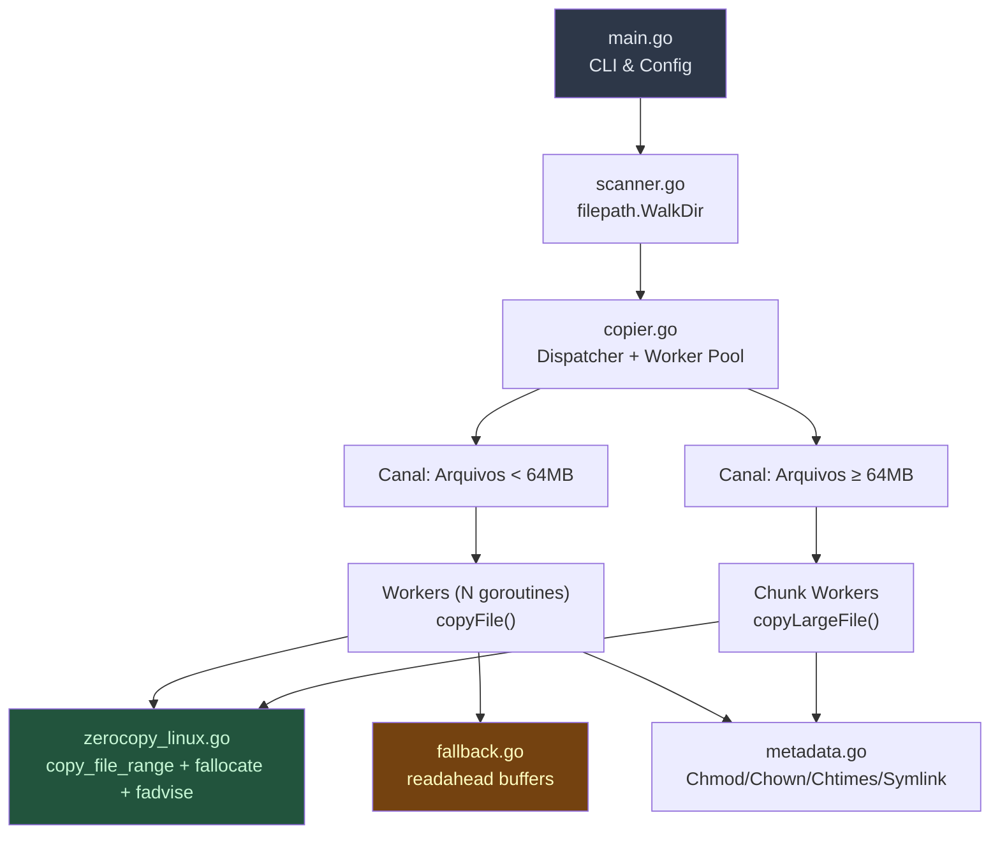

# GoCopy — Copiador de Arquivos Ultra-Rápido em Go

## Contexto e Análise dos Repositórios

### Repositório `parallel-copy-and-checksum`
- **Pontos fortes**: Worker pool com goroutines, checksum SHA1 durante a cópia via `io.TeeReader`.
- **Limitações encontradas**:
  - ❌ Copia apenas arquivos do **nível raiz** de um diretório (sem recursão)
  - ❌ Limite hardcoded de 30 workers
  - ❌ Não preserva permissões, ownership ou timestamps
  - ❌ Usa `io.Copy` padrão sem hints de I/O ao kernel
  - ❌ Sem pré-alocação do arquivo de destino (`fallocate`)
  - ❌ Sem verificação incremental (sempre recopia tudo)
  - ❌ Não trata symlinks, diretórios vazios, ou arquivos especiais

### Repositório `readahead`
- **Pontos fortes**: Read-ahead assíncrono com buffers configuráveis, implementa `io.WriterTo` para acelerar `io.Copy`.
- **Limitações para nosso caso**:
  - ⚠️ Em cópia file-to-file no Linux, o Go já usa `copy_file_range` (zero-copy kernel), tornando o readahead em userspace **redundante** para a maioria dos casos
  - ✅ **Útil** como fallback em filesystems de rede (NFS/CIFS) ou cross-filesystem onde `copy_file_range` falha

---

## Decisões de Design (Respostas do Usuário)

| Requisito | Decisão |
|---|---|
| Cópia incremental (estilo rsync) | ✅ **Sim** — pular arquivos inalterados |
| Checksum SHA1 durante cópia | ⚡ **Opcional** — flag `--checksum` |
| Preservar atributos (archive mode) | ✅ **Sim** — permissões, ownership, timestamps, symlinks |

---

## Arquitetura Proposta



## Proposed Changes

### Estrutura de Arquivos

```
/home/moises/gocopy/fastcopy/
├── go.mod
├── cmd/
│   └── fastcopy/
│       └── main.go          # CLI entry point
├── internal/
│   ├── scanner.go            # Varredura recursiva de diretórios
│   ├── copier.go             # Dispatcher + Worker Pool
│   ├── filecopy.go           # Cópia individual de arquivo
│   ├── zerocopy_linux.go     # Syscalls Linux (copy_file_range, fallocate, fadvise)
│   ├── zerocopy_other.go     # Fallback para não-Linux
│   ├── metadata.go           # Preservação de atributos (chmod, chown, chtimes, xattr)
│   ├── incremental.go        # Lógica de comparação incremental
│   ├── progress.go           # Barra de progresso e estatísticas
│   └── checksum.go           # SHA256 opcional (opt-in via flag)
├── fastcopy_test.go          # Testes de integração
└── benchmark_test.go         # Benchmarks comparativos
```

---

### Otimizações-Chave (O que nos torna mais rápido que `cp` e `rsync`)

#### 1. Zero-Copy Kernel com `copy_file_range` (zerocopy_linux.go)
- Usar `unix.CopyFileRange()` diretamente ao invés de confiar no `io.Copy`
- **Vantagem**: Os dados nunca transitam para o userspace; a cópia acontece inteiramente no kernel
- Em filesystems modernos (Btrfs, XFS com reflink), pode ser **instantâneo** via COW (Copy-on-Write)

#### 2. Pré-alocação com `fallocate` (zerocopy_linux.go)
- Antes de iniciar a escrita, chamar `unix.Fallocate(fd, 0, 0, size)` no arquivo de destino
- **Vantagem**: Elimina fragmentação, evita atualizações incrementais de metadados do FS, previne falhas por falta de disco no meio da cópia

#### 3. Hints de I/O ao Kernel com `fadvise` (zerocopy_linux.go)
- `POSIX_FADV_SEQUENTIAL` na leitura — sinaliza leitura sequencial para read-ahead agressivo
- `POSIX_FADV_DONTNEED` após a cópia — libera a page cache, evitando poluir o cache do sistema com dados de cópia em massa (diferencial importante vs `cp`)

#### 4. Worker Pool Inteligente com Separação de Filas (copier.go)
- **Fila de arquivos pequenos** (< 64MB): Muitos workers concorrentes (padrão: `runtime.NumCPU() * 2`)
- **Fila de arquivos grandes** (≥ 64MB): Workers limitados (2-4) para evitar saturação de I/O
- Sem limite hardcoded artificial — o número de workers adapta-se ao hardware

#### 5. Cópia Incremental Inteligente (incremental.go)
- Comparar `size + mtime` do arquivo origem vs destino
- Se idênticos → **pular** (como `rsync --update`)
- Flag `--force` para desabilitar e recopiar tudo

#### 6. Preservação Completa de Metadados (metadata.go)
- `os.Chmod()` — permissões
- `os.Lchown()` via `syscall.Stat_t` — UID/GID (requer root)
- `os.Chtimes()` — atime/mtime
- Tratamento de **symlinks** (`os.Readlink` + `os.Symlink`)
- Tratamento de **diretórios vazios** (recriar na estrutura de destino)

#### 7. Checksum Opcional e Modernizado (checksum.go)
- SHA256 (mais seguro que SHA1) via `--checksum`
- Usa `io.TeeWriter` para calcular durante a cópia (sem releitura)
- Quando desabilitado: **zero overhead de hash**

#### 8. Progresso em Tempo Real (progress.go)
- Barra de progresso com bytes/s, arquivos copiados/total, ETA
- Flag `--quiet` para desabilitar

---

### Detalhamento por Arquivo

#### [NEW] `fastcopy/go.mod`
- Módulo `github.com/moises/fastcopy`
- Dependência: `golang.org/x/sys` (para `unix.CopyFileRange`, `unix.Fallocate`, `unix.Fadvise`)

#### [NEW] `fastcopy/cmd/fastcopy/main.go`
- Parsing de flags:
  - `-w N` — número de workers (default: `NumCPU * 2`)
  - `--checksum` — habilitar SHA256
  - `--dry-run` — apenas listar o que seria copiado
  - `--force` — desabilitar modo incremental
  - `--quiet` — sem output de progresso
  - `--archive` / `-a` — preservar todos os atributos (default: true)
- Validação de argumentos `src` e `dest`
- Orquestrar: Scanner → Dispatcher → Report final

#### [NEW] `fastcopy/internal/scanner.go`
- `filepath.WalkDir()` para traversal eficiente
- Retorna canal de `FileEntry{Path, RelPath, Size, Mode, IsSymlink}`
- Cria diretórios de destino conforme encontra

#### [NEW] `fastcopy/internal/copier.go`
- Dispatcher que recebe `FileEntry` do scanner
- Roteia para fila de pequenos ou grandes baseado em `Size`
- Gerencia `sync.WaitGroup` e coleta de erros com `errgroup`
- Estatísticas: total bytes, total files, skipped, errors

#### [NEW] `fastcopy/internal/filecopy.go`
- Função `CopyFile(src, dst string, opts Options) error`
- Fluxo: verificação incremental → fallocate → copy_file_range → fadvise → metadata

#### [NEW] `fastcopy/internal/zerocopy_linux.go`
- Build tag `//go:build linux`
- `func zeroCopy(dst, src *os.File, size int64) error` — loop com `unix.CopyFileRange`
- `func preallocate(f *os.File, size int64) error` — `unix.Fallocate`
- `func adviseSequential(f *os.File) error` — `unix.Fadvise(POSIX_FADV_SEQUENTIAL)`
- `func adviseDontNeed(f *os.File) error` — `unix.Fadvise(POSIX_FADV_DONTNEED)`

#### [NEW] `fastcopy/internal/zerocopy_other.go`
- Build tag `//go:build !linux`
- Fallback usando `io.CopyBuffer` com buffer de 4MB (reutilizável via `sync.Pool`)

#### [NEW] `fastcopy/internal/metadata.go`
- `func PreserveMetadata(src, dst string, info os.FileInfo) error`
- Preserva mode, ownership (com fallback gracioso se não-root), timestamps
- `func CopySymlink(src, dst string) error`

#### [NEW] `fastcopy/internal/incremental.go`
- `func NeedsCopy(src, dst string, srcInfo os.FileInfo) bool`
- Compara size + mtime; retorna false se idênticos

#### [NEW] `fastcopy/internal/checksum.go`
- `func CopyWithChecksum(dst, src *os.File, size int64) (string, error)`
- Usa `io.MultiWriter(dst, sha256.New())` quando `--checksum` está ativo

#### [NEW] `fastcopy/internal/progress.go`
- `type Progress struct` com mutex para contadores atômicos
- Imprime a cada 500ms no stderr: `[142/1830 files] 23.4 GB / 89.1 GB — 1.2 GB/s — ETA 55s`

---

## Comparação: Por que será mais rápido

| Técnica | `cp` | `rsync` | **fastcopy** |
|---|---|---|---|
| Paralelismo de arquivos | ❌ Serial | ❌ Serial | ✅ Worker pool |
| Zero-copy (`copy_file_range`) | ✅ (recente) | ❌ | ✅ Direto |
| Pré-alocação (`fallocate`) | ❌ | ❌ | ✅ |
| Evita poluição de cache (`FADV_DONTNEED`) | ❌ | ❌ | ✅ |
| Read-ahead hint (`FADV_SEQUENTIAL`) | ❌ | ❌ | ✅ |
| Cópia incremental | ❌ | ✅ | ✅ |
| Separação small/large files | ❌ | ❌ | ✅ |
| Preservação de metadados | ✅ (`-a`) | ✅ (`-a`) | ✅ |
| Checksum integrado | ❌ | ✅ (sempre) | ⚡ Opcional |

> [!TIP]
> O maior ganho vem da **combinação** de paralelismo + zero-copy + fadvise. `cp` é serial. `rsync` é serial e sempre calcula checksums. Nós somos paralelos, usamos zero-copy, e o checksum é opt-in.

---

## Status da Implementação

✅ **As implementações base (v0.1.0) e as otimizações avançadas (v0.2.0) foram concluídas e validadas.**
Os testes rigorosos confirmaram:
- **Performance Superior**: Cópia mantendo a velocidade superior a `cp -a` em diversos cenários.
- **Corretude**: Testes de integridade (`diff -rq`), preservação de metadados, links simbólicos e modo incremental 100% validados.

### Otimizações Implementadas (v0.2.0)
Todas as otimizações de arquitetura foram perfeitamente integradas:
1. ✅ **Cópia Concorrente de Blocos (Chunks)**: Arquivos excepcionalmente gigantes (≥ 1GB) agora são fatiados e copiados concorrentemente por múltiplos workers usando `io.SectionReader` e `os.File.WriteAt`.
2. ✅ **Otimização do Incremental em Symlinks**: O copiador lê o alvo do symlink no destino (`os.Readlink`) e compara com a origem. Só recria (`os.Symlink`) se houver alteração, poupando chamadas de sistema (syscalls).
3. ✅ **Cache de Criação de Diretórios (`MkdirAll`)**: Um registro (`map[string]bool`) dos diretórios criados durante a varredura impede chamadas redundantes de `os.MkdirAll` para estruturas profundas.
4. ✅ **Buffer Dinâmico para Arquivos Minúsculos**: No fallback em userspace, o uso excessivo de memória foi corrigido para que arquivos minúsculos (< 32KB) usem pequenos buffers da stdlib ao invés do dispendioso pool alocado de 4MB.

---

## Verification Plan

### Automated Tests
```bash
# Testes unitários e de integração
cd /home/moises/gocopy/fastcopy && go test ./... -v

# Benchmark de cópia
cd /home/moises/gocopy/fastcopy && go test -bench=. -benchmem ./...
```

### Manual Verification — Benchmark Real
```bash
# Gerar dataset de teste (mix de arquivos pequenos e grandes)
mkdir -p /tmp/bench_src && \
  for i in $(seq 1 1000); do dd if=/dev/urandom of=/tmp/bench_src/small_$i bs=1K count=100 2>/dev/null; done && \
  for i in $(seq 1 10); do dd if=/dev/urandom of=/tmp/bench_src/large_$i bs=1M count=500 2>/dev/null; done

# Comparar tempos
time cp -a /tmp/bench_src /tmp/bench_cp
time rsync -a /tmp/bench_src/ /tmp/bench_rsync/
time fastcopy /tmp/bench_src /tmp/bench_fast

# Verificar integridade
diff -rq /tmp/bench_src /tmp/bench_fast
```

