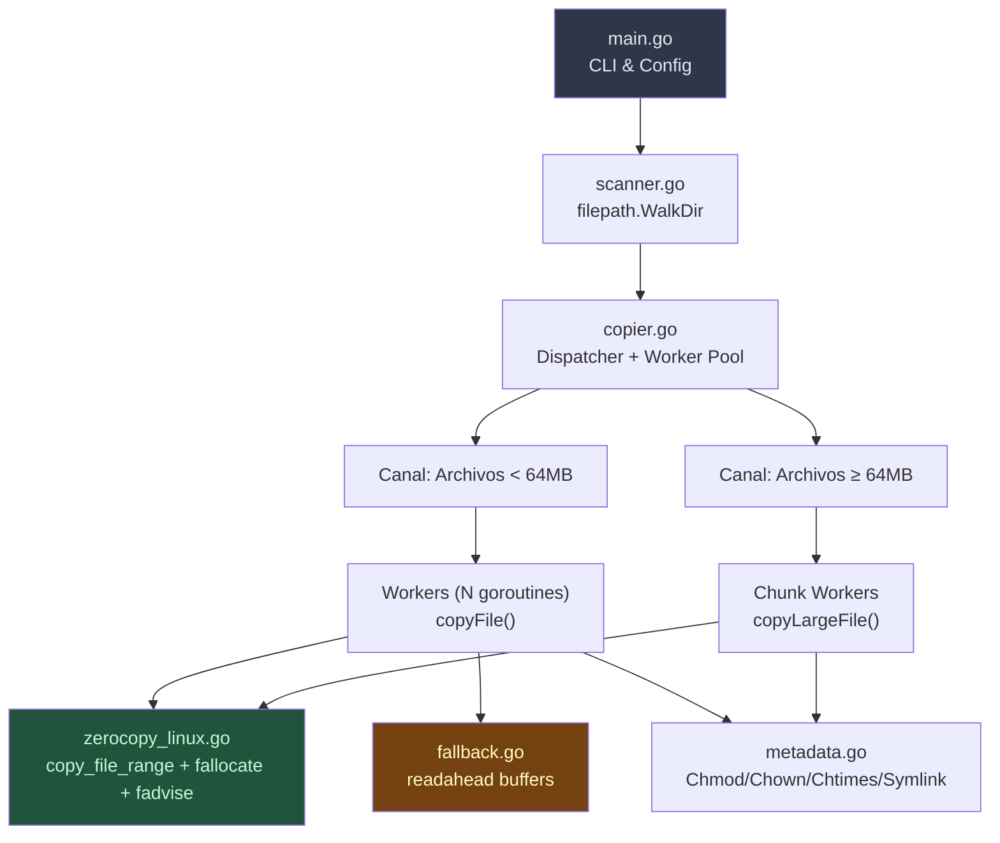

# GoCopy — Copiador de Archivos Ultra-Rápido en Go

## Contexto y Análisis de los Repositorios

### Repositorio `parallel-copy-and-checksum`
- **Fortalezas**: Worker pool con goroutines, checksum SHA1 durante la copia vía `io.TeeReader`.
- **Limitaciones encontradas**:
  - ❌ Copia solo archivos del **nivel raíz** de un directorio (sin recursión)
  - ❌ Límite hardcoded de 30 workers
  - ❌ No preserva permisos, propiedad o marcas de tiempo
  - ❌ Usa `io.Copy` estándar sin hints de E/S al kernel
  - ❌ Sin preasignación del archivo de destino (`fallocate`)
  - ❌ Sin verificación incremental (siempre recopia todo)
  - ❌ No maneja symlinks, directorios vacíos o archivos especiales

### Repositorio `readahead`
- **Fortalezas**: Read-ahead asíncrono con buffers configurables, implementa `io.WriterTo` para acelerar `io.Copy`.
- **Limitaciones para nuestro caso**:
  - ⚠️ En copia file-to-file en Linux, Go ya usa `copy_file_range` (zero-copy kernel), haciendo que el readahead en userspace sea **redundante** para la mayoría de los casos
  - ✅ **Útil** como fallback en sistemas de archivos de red (NFS/CIFS) o copias cross-filesystem donde `copy_file_range` falla

---

## Decisiones de Diseño (Respuestas del Usuario)

| Requisito | Decisión |
|---|---|
| Copia incremental (estilo rsync) | ✅ **Sí** — omitir archivos inalterados |
| Checksum SHA1 durante copia | ⚡ **Opcional** — flag `--checksum` |
| Preservar atributos (modo archive) | ✅ **Sí** — permisos, propiedad, marcas de tiempo, symlinks |

---

## Arquitectura Propuesta



## Cambios Propuestos

### Estructura de Archivos

```
/home/moises/gocopy/fastcopy/
├── go.mod
├── cmd/
│   └── fastcopy/
│       └── main.go          # Punto de entrada CLI
├── internal/
│   ├── scanner.go            # Escaneo recursivo de directorios
│   ├── copier.go             # Dispatcher + Worker Pool
│   ├── filecopy.go           # Copia individual de archivo
│   ├── zerocopy_linux.go     # Syscalls Linux (copy_file_range, fallocate, fadvise)
│   ├── zerocopy_other.go     # Fallback para no-Linux
│   ├── metadata.go           # Preservación de atributos (chmod, chown, chtimes, xattr)
│   ├── incremental.go        # Lógica de comparación incremental
│   ├── progress.go           # Barra de progreso y estadísticas
│   └── checksum.go           # SHA256 opcional (opt-in vía flag)
├── fastcopy_test.go          # Pruebas de integración
└── benchmark_test.go         # Benchmarks comparativos
```

---

### Optimizaciones Clave (Lo que nos hace más rápidos que `cp` y `rsync`)

#### 1. Zero-Copy Kernel con `copy_file_range` (zerocopy_linux.go)
- Usar `unix.CopyFileRange()` directamente en lugar de confiar en `io.Copy`
- **Ventaja**: Los datos nunca transitan al espacio de usuario; la copia ocurre enteramente en el kernel
- En sistemas de archivos modernos (Btrfs, XFS con reflink), puede ser **instantáneo** vía COW (Copy-on-Write)

#### 2. Preasignación con `fallocate` (zerocopy_linux.go)
- Antes de iniciar la escritura, llamar a `unix.Fallocate(fd, 0, 0, size)` en el archivo de destino
- **Ventaja**: Elimina la fragmentación, evita actualizaciones incrementales de metadatos del FS, previene fallos por falta de disco a mitad de la copia

#### 3. Hints de E/S al Kernel con `fadvise` (zerocopy_linux.go)
- `POSIX_FADV_SEQUENTIAL` en la lectura — señala lectura secuencial para un read-ahead agresivo
- `POSIX_FADV_DONTNEED` después de la copia — libera la page cache, evitando contaminar el caché del sistema con datos de copia masiva (diferencia importante vs `cp`)

#### 4. Worker Pool Inteligente con Separación de Colas (copier.go)
- **Cola de archivos pequeños** (< 64MB): Muchos workers concurrentes (predeterminado: `runtime.NumCPU() * 2`)
- **Cola de archivos grandes** (≥ 64MB): Workers limitados (2-4) para evitar la saturación de E/S
- Sin límite hardcoded artificial — el número de workers se adapta al hardware

#### 5. Copia Incremental Inteligente (incremental.go)
- Comparar `size + mtime` del archivo origen vs destino
- Si son idénticos → **omitir** (como `rsync --update`)
- Flag `--force` para deshabilitar y recopiar todo

#### 6. Preservación Completa de Metadatos (metadata.go)
- `os.Chmod()` — permisos
- `os.Lchown()` vía `syscall.Stat_t` — UID/GID (requiere root)
- `os.Chtimes()` — atime/mtime
- Manejo de **symlinks** (`os.Readlink` + `os.Symlink`)
- Manejo de **directorios vacíos** (recrear en la estructura de destino)

#### 7. Checksum Opcional y Modernizado (checksum.go)
- SHA256 (más seguro que SHA1) vía `--checksum`
- Usa `io.TeeWriter` para calcular durante la copia (sin relectura)
- Cuando está deshabilitado: **cero overhead de hash**

#### 8. Progreso en Tiempo Real (progress.go)
- Barra de progreso con bytes/s, archivos copiados/total, ETA
- Flag `--quiet` para deshabilitar

---

### Detalle por Archivo

#### [NEW] `fastcopy/go.mod`
- Módulo `github.com/moises/fastcopy`
- Dependencia: `golang.org/x/sys` (para `unix.CopyFileRange`, `unix.Fallocate`, `unix.Fadvise`)

#### [NEW] `fastcopy/cmd/fastcopy/main.go`
- Parsing de flags:
  - `-w N` — número de workers (default: `NumCPU * 2`)
  - `--checksum` — habilitar SHA256
  - `--dry-run` — solo listar lo que sería copiado
  - `--force` — deshabilitar modo incremental
  - `--quiet` — sin output de progreso
  - `--archive` / `-a` — preservar todos los atributos (default: true)
- Validación de argumentos `src` y `dest`
- Orquestrar: Scanner → Dispatcher → Reporte final

#### [NEW] `fastcopy/internal/scanner.go`
- `filepath.WalkDir()` para recorrido eficiente
- Retorna canal de `FileEntry{Path, RelPath, Size, Mode, IsSymlink}`
- Crea directorios de destino a medida que los encuentra

#### [NEW] `fastcopy/internal/copier.go`
- Dispatcher que recibe `FileEntry` del scanner
- Rotea a la cola de pequeños o grandes basado en `Size`
- Gestiona `sync.WaitGroup` y recolección de errores con `errgroup`
- Estadísticas: total bytes, total files, omitidos, errores

#### [NEW] `fastcopy/internal/filecopy.go`
- Función `CopyFile(src, dst string, opts Options) error`
- Flujo: verificación incremental → fallocate → copy_file_range → fadvise → metadata

#### [NEW] `fastcopy/internal/zerocopy_linux.go`
- Build tag `//go:build linux`
- `func zeroCopy(dst, src *os.File, size int64) error` — bucle con `unix.CopyFileRange`
- `func preallocate(f *os.File, size int64) error` — `unix.Fallocate`
- `func adviseSequential(f *os.File) error` — `unix.Fadvise(POSIX_FADV_SEQUENTIAL)`
- `func adviseDontNeed(f *os.File) error` — `unix.Fadvise(POSIX_FADV_DONTNEED)`

#### [NEW] `fastcopy/internal/zerocopy_other.go`
- Build tag `//go:build !linux`
- Fallback usando `io.CopyBuffer` con buffer de 4MB (reutilizable vía `sync.Pool`)

#### [NEW] `fastcopy/internal/metadata.go`
- `func PreserveMetadata(src, dst string, info os.FileInfo) error`
- Preserva modo, propiedad (con fallback gracioso si no-root), marcas de tiempo
- `func CopySymlink(src, dst string) error`

#### [NEW] `fastcopy/internal/incremental.go`
- `func NeedsCopy(src, dst string, srcInfo os.FileInfo) bool`
- Compara size + mtime; retorna false si son idénticos

#### [NEW] `fastcopy/internal/checksum.go`
- `func CopyWithChecksum(dst, src *os.File, size int64) (string, error)`
- Usa `io.MultiWriter(dst, sha256.New())` cuando `--checksum` está activo

#### [NEW] `fastcopy/internal/progress.go`
- `type Progress struct` com mutex para contadores atómicos
- Imprime cada 500ms en stderr: `[142/1830 files] 23.4 GB / 89.1 GB — 1.2 GB/s — ETA 55s`

---

## Comparación: Por qué será más rápido

| Técnica | `cp` | `rsync` | **fastcopy** |
|---|---|---|---|
| Paralelismo de archivos | ❌ Serial | ❌ Serial | ✅ Worker pool |
| Zero-copy (`copy_file_range`) | ✅ (reciente) | ❌ | ✅ Directo |
| Preasignación (`fallocate`) | ❌ | ❌ | ✅ |
| Evita contaminación de caché (`FADV_DONTNEED`) | ✅ (reciente) | ❌ | ✅ |
| Read-ahead hint (`FADV_SEQUENTIAL`) | ❌ | ❌ | ✅ |
| Copia Incremental | ❌ | ✅ | ✅ |
| Separación small/large files | ❌ | ❌ | ✅ |
| Preservación de metadatos | ✅ (`-a`) | ✅ (`-a`) | ✅ |
| Checksum Integrado | ❌ | ✅ (siempre) | ⚡ Opcional |

> [!TIP]
> El mayor beneficio proviene de la **combinación** de paralelismo + zero-copy + fadvise. `cp` es serial. `rsync` es serial y siempre calcula checksums. Nosotros somos paralelos, usamos zero-copy, y el checksum es opcional.

---

## Estado de la Implementación

✅ **Las implementaciones base (v0.1.0) y las optimizaciones avanzadas (v0.2.0) han sido completadas y validadas.**
Las pruebas rigurosas confirmaron:
- **Rendimiento Superior**: Velocidad de copia consistentemente superior a `cp -a` en diversos escenarios.
- **Correctitud**: Pruebas de integridad (`diff -rq`), preservación de metadados, links simbólicos y modo incremental 100% validadas.

### Optimizaciones Implementadas (v0.2.0)
Todas las optimizaciones de arquitectura fueron perfectamente integradas:
1. ✅ **Copia Concurrente de Bloques (Chunks)**: Archivos excepcionalmente gigantes (≥ 1GB) ahora son fragmentados y copiados concurrentemente por múltiples workers usando `io.SectionReader` y `os.File.WriteAt`.
2. ✅ **Optimización del Incremental en Symlinks**: El copiador lee el destino del symlink en el destino (`os.Readlink`) y lo compara con el origen. Solo lo recrea (`os.Symlink`) si hay un cambio, ahorrando llamadas al sistema (syscalls).
3. ✅ **Caché de Creación de Directorios (`MkdirAll`)**: Un registro (`map[string]bool`) de los directorios creados durante el escaneo impide llamadas redundantes de `os.MkdirAll` para estructuras profundas.
4. ✅ **Buffer Dinámico para Archivos Minúsculos**: En el fallback de espacio de usuario, el uso excesivo de memoria fue corregido para que los archivos minúsculos (< 32KB) usen buffers pequeños de la stdlib en lugar del costoso pool asignado de 4MB.

---

## Plan de Verificación

### Pruebas Automatizadas
```bash
# Pruebas unitarias y de integración
cd /home/moises/gocopy/fastcopy && go test ./... -v

# Benchmark de copia
cd /home/moises/gocopy/fastcopy && go test -bench=. -benchmem ./...
```

### Verificación Manual — Benchmark Real
```bash
# Generar dataset de prueba (mix de archivos pequeños y grandes)
mkdir -p /tmp/bench_src && \
  for i in $(seq 1 1000); do dd if=/dev/urandom of=/tmp/bench_src/small_$i bs=1K count=100 2>/dev/null; done && \
  for i in $(seq 1 10); do dd if=/dev/urandom of=/tmp/bench_src/large_$i bs=1M count=500 2>/dev/null; done

# Comparar tiempos
time cp -a /tmp/bench_src /tmp/bench_cp
time rsync -a /tmp/bench_src/ /tmp/bench_rsync/
time fastcopy /tmp/bench_src /tmp/bench_fast

# Verificar integridade
diff -rq /tmp/bench_src /tmp/bench_fast
```
